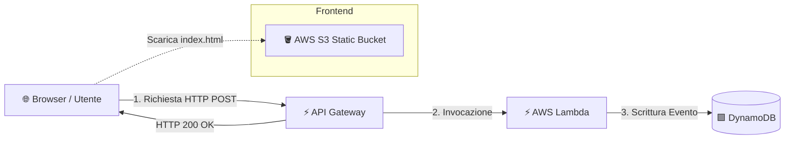

# 🚀 Serverless Visitor Counter (AWS + Terraform)

Progetto di infrastruttura Cloud Serverless sviluppato interamente tramite **Terraform** (Infrastructure as Code). L'applicazione traccia le visite degli utenti in tempo reale registrando gli eventi su un database NoSQL.

---

## 📐 Schema Architetturale

🛠️ Stack Tecnologico & Servizi AWS
Infrastructure as Code: Terraform

Compute: AWS Lambda (Python 3.9)

API Layer: AWS API Gateway (HTTP API)

Database: AWS DynamoDB (Pay-Per-Request)

Storage & Hosting: AWS S3 (Static Website Hosting)

Security: AWS IAM (Least-privilege execution roles)

💡 Funzionalità Principali
Serverless Architecture: Nessun server da gestire, scaling automatico da zero a migliaia di richieste.

CORS Configurato: Gestione corretta delle intestazioni Cross-Origin per consentire le chiamate dal frontend S3 all'API Gateway.

Auto-deploy con Terraform: Il pacchetto ZIP di Lambda e l'upload dei file statici su S3 vengono gestiti direttamente dal codice IaC.
